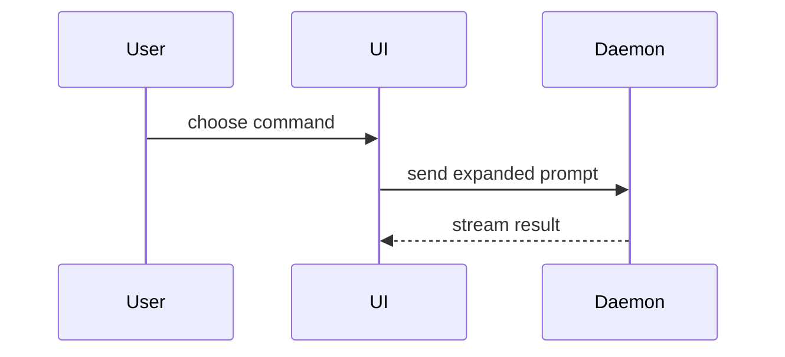

# Fihànmí

Show the current subject so the user can understand its shape. Skip the preamble and keep prose brief. Pick the smallest view that makes the key point clear.

Use the supplied/current material and inspect available evidence when needed to derive the structure being shown. Do not invent normative intent, unsupported causality, desired ownership, decisions, recommendations, verdicts, readiness, or priorities. When another skill already established the meaning, represent that result rather than re-deciding it.

## Pick the representation from the relationship

```text
logic / algorithm        → pseudocode
execution / ordering     → call tree
UI / composition         → component tree
ownership / repository   → shallow responsibility or file tree
before / after           → shape-aware explanatory diff
new complete shape       → whole block
state / lifecycle        → state sketch or Mermaid
interaction / data flow  → Mermaid or concise directed flow
comparison               → aligned comparison
```

Representative shapes:

```text
on(save)
  if content is unchanged
    return cached result
  write new content
  return fresh result
```

```text
submitForm
  createSession
    persistPrompt
    launchAgent
  navigateToSession
```

```text
<SessionPage>
  useSessionEvents()
  <SessionToolbar>
    <RunSkillButton />
  <SessionTimeline>
```

```text
src/
├── commands/      # parses actions
├── sessions/      # owns state
└── transport/     # sends requests
```

Use Mermaid when interaction, sequence, state, or topology is materially clearer in two dimensions:



Use prose when a visual would only restate a short sentence or list. Use several forms only when they expose genuinely different relationships; do not produce a gallery by default.

## Show change in the shape that changed

Use `diff` when the surrounding shape already exists and the point is the change.

Component change:

```diff
 <SessionPage>
   <SessionToolbar>
+    <RunSkillButton />
   <SessionTimeline>
+    <SkillResultCard />
```

File/responsibility change:

```diff
 src/
 ├── commands/
+│   └── show-me.ts
 ├── sessions/
-└── transport.ts
+└── transport/
+    ├── client.ts
+    └── stream.ts
```

Call-path change:

```diff
 submitForm
   createSession
     persistPrompt
+    expandSkillMention
     launchAgent
-  navigateToSession
+  navigateToSession
+    subscribeToEvents
```

State/control-flow change:

```diff
 on(save)
-  write content
+  if content is unchanged
+    return cached result
+  write content
+  invalidate cache
```

These are explanatory shape diffs unless backed by exact source evidence.

Show the complete block/tree/flow instead when most of it is new, omitted context would hide ownership or order, or the user needs a copyable target shape:

```ts
function expandSkill(command: string): string {
  const skillName = command.slice(1)
  return `use the ${skillName} skill`
}
```

## Keep the visual faithful

- Preserve exact wording when the wording itself is evidence or the requested result; a visual may support it but must not replace it.
- Distinguish `Observed`, `Inferred`, `Proposed`, and `Illustrative` when the distinction materially affects how authoritative the visual appears.
- Do not complete missing relationships merely to make a diagram tidy. Omit them or mark the gap.
- Keep complete before/after views comparable in abstraction, scale, grammar, and labeling.
- When showing ownership, state transitions, recovery, or another consequential relationship, include only the source-backed detail needed for the current question. Do not turn the visual into a separate diagnostic exercise.

Keep only the calls, files, props, states, boundaries, options, and evidence needed to answer the current question.

## Adjacent results

Use `salaye` when the requested result is primarily a newcomer-oriented plain-language explanation. Use `html-artifact` when the requested result is a substantial standalone browser information projection. A requested presentation/deck remains `slides`.

These are result boundaries, not mandatory stages. Do not escalate merely because a richer representation is possible.

## Output

Place each visual next to only the short text or exact evidence it supports. The representation is the result; do not append a second analysis, decision, or report.
