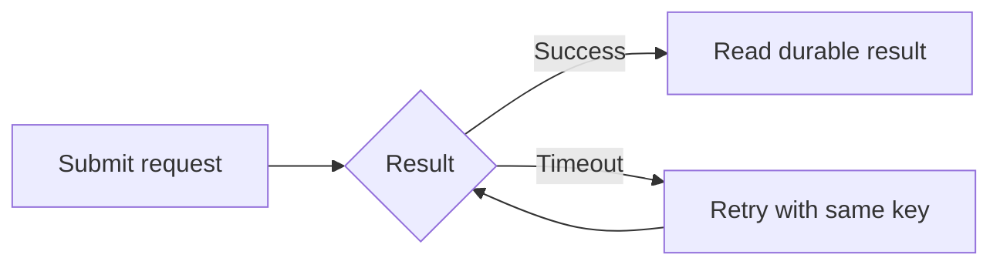
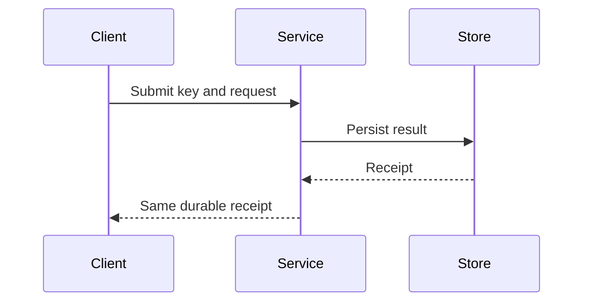
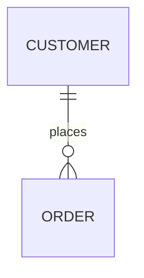

# Mermaid recipes

Use for directed structure, not every illustration. These small specimens deliberately use established flowchart, sequence, state and ER grammars. Verify other/new diagram grammars against the installed version rather than copying an ecosystem catalogue.

The companion renderer asset targets Mermaid **12.0.0** using its documented `render` API, `securityLevel: strict`, `startOnLoad: false` and a neutral theme. Version identity is not evidence of successful rendering. Real-library tests and loader contract tests are distinct.

Copy the applicable source into a `pre.mermaid` inside a labelled `figure`, alongside a readable explanation. Add a sibling `div[data-diagram-output]` and `p[data-diagram-status]` for the renderer asset. Before rendering or after failure, the explanation and source remain visible. Portable delivery renders to SVG locally and omits the remote loader.

## Branch / flow

## Exchange / sequence

## Lifecycle / state

```mermaid
stateDiagram-v2
  accTitle: Work lifecycle
  accDescr: Pending work can complete or cancel; both are terminal.
  [*] --> Pending
  Pending --> Completed: success
  Pending --> Cancelled: cancel
  Completed --> [*]
  Cancelled --> [*]
```

## Entity relationship

The domain owner must confirm whether these rules fit the real system. These are syntax specimens, not requirements.

## Safety, themes and interaction

Treat labels as escaped text, not executable HTML. Keep Mermaid configuration authored by the artifact, not embedded in untrusted source. Do not relax strict security to enable callbacks. Do not couple controls to Mermaid's generated internal IDs: put an ordinary accessible selector beside the diagram or use a suitable interactive renderer.

Keep neutral Mermaid output readable in either document theme; an explicit light figure surface is acceptable. Re-rendering on theme changes is optional and must retain original source, stable targets and error fallbacks. Semantic colour may be added where useful without imposing a palette on the document.

Primary references: [usage/render](https://mermaid.js.org/config/usage.html), [accessibility](https://mermaid.js.org/config/accessibility.html), [flowchart](https://mermaid.js.org/syntax/flowchart.html). Revalidate the target release when changing the integration.
