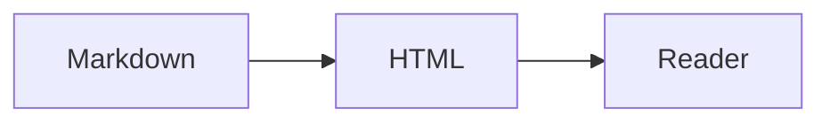

# A small release handoff

```tldr What the reader needs
The **offline page is ready**. This sample uses invented data to demonstrate the page controls; it is not release evidence. Agents edit this Markdown, and people read the generated HTML.
```

## Compare the options

| Option | Works offline | Reader action |
| --- | --- | --- |
| Inline SVG | Yes | Inspect small, labelled charts |
| Opt-in renderer | Source fallback | Preview a large diagram |

See [the sample chart](#sample-chart). Keep the *reason for the choice* beside it.

## Sample chart

```chart
{"type":"bars","title":"Illustrative completed checks","unit":"checks","labels":["Draft","Review","Handoff"],"values":[3,5,8]}
```

## Read the code

````tabs Code samples
## Python
```python
print("Hello, reader")
```
## JavaScript
```js
console.log("Hello, reader");
```
````

````details What the page preserves
The source keeps **facts, uncertainty and identifiers**. A collapsed section remains present in the HTML and opens for print.

```text
Sample note: the data above is illustrative.
```
````

## Milestones

```timeline Sample handoff
[
  {"time":"09:00","title":"Draft","text":"Record the supplied facts."},
  {"time":"09:20","title":"Review","text":"Check keyboard controls and both themes."},
  {"time":"09:30","title":"Handoff","text":"Generate the page from this source."}
]
```

## Diagram source



## Follow-up

- [x] Keep the Markdown as the source.
- [ ] Replace the sample data before using this as a report.
- Retain:
  - source revision;
  - proof limits.

> A preview proves the page renders. It does not establish the truth of the report.

```callout Sharing
Commit the Markdown. Generate HTML on demand, and keep an HTML copy only when someone must receive a file.
```
