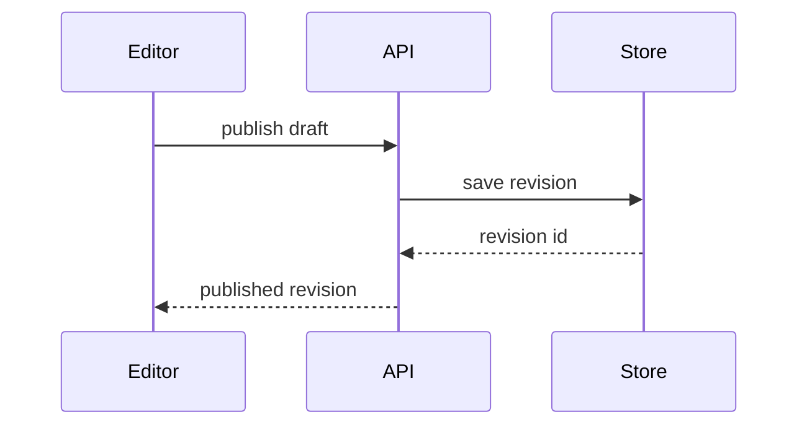

# Ṣàlàyé

Make the current topic clear through a small, focused visual. Start with the representation and keep supporting prose brief. Use the form that best exposes the relationship the reader needs to understand.

- Describe logic with pseudocode:

```text
on(publish)
  if draft is invalid
    return validation errors
  save revision
  queue notification
```

- Show nested execution and ordering with a call tree:

```text
publishDraft
  validateDraft
  saveRevision
  queueNotification
```

- Sketch UI composition with a component tree. Include relevant source paths, state, and module boundaries:

```text
<DraftPage> (src/pages/draft.tsx)
  useDraftState()
  <DraftToolbar> (src/components)
    <PublishButton />
```

- Map file responsibilities or a broad refactor with a shallow annotated tree:

```text
src/
├── commands/       # accepts publishing actions
├── drafts/         # owns draft state and validation
└── notifications/  # delivers revision updates
```

- Use Mermaid for interactions, data flow, or state transitions:



- When the surrounding shape already exists, show the change as a diff in that same form.

Component change:

```diff
 <DraftPage>
   useDraftState()
   <DraftToolbar>
+    <PublishButton />
   <DraftBody />
```

File responsibility change:

```diff
 src/
 ├── commands/
 ├── drafts/
-└── notifications.ts
+└── notifications/
+    ├── queue.ts
+    └── worker.ts
```

Call-order change:

```diff
 publishDraft
   validateDraft
+  checkExpectedRevision
   saveRevision
-  sendNotification
+  queueNotification
```

State or control-flow change:

```diff
 on(publish)
+  if draft is invalid
+    return validation errors
   save revision
-  send notification
+  queue notification
```

- Show the complete block when it is mostly new, omitted context would obscure ownership or order, or the reader needs a copyable target:

```ts
function revisionLabel(revision: number): string {
  return `Revision ${revision}`;
}
```

- For UI, layout, state comparisons, or concepts that need more visual freedom than Mermaid, create one focused HTML diagram or infographic using `html-artifact`; use `slides` for a short deck. Match the product's colors, typography, spacing, and components, use real labels and data, and make it readable on desktop and mobile. Open the verified result through the available host preview, reusing that surface after updates; return its working locator if preview is unavailable.

## Guidance

Place each visual beside the brief explanation or evidence it supports. Include only the calls, files, props, states, boundaries, and alternatives relevant to the current question.

Choose one or several representations as useful; do not force every form into the answer. A short prose answer is sufficient when a visual would add no clarity.

Keep the representation faithful to supplied material. Distinguish proposed or illustrative shapes from observed implementation; preserve uncertainty and do not invent relationships or decisions. Keep before/after views comparable in scale, detail, and labels.
